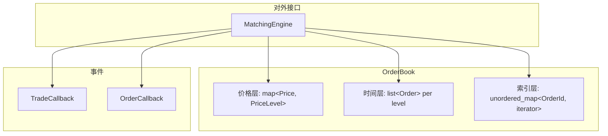

# LOB — C++ Limit Order Book Matching Engine

> 面向市场微观结构的高性能限价订单簿与撮合引擎，覆盖 Level-3 语义下的挂单、撤单、改单与多种 Time-in-Force 订单类型。

---

## 项目概述

本项目实现了一个**单品种、单线程**的电子化交易撮合核心：维护买卖双边订单簿，按**价格–时间优先**规则撮合成交，并通过回调接口向外推送成交与订单状态事件。价格以整数 tick 表示，避免浮点误差；架构上采用工业 LOB 常见的三层索引设计，在教学可读性与性能意识之间取得平衡。


---

## 核心亮点

| 维度 | 说明 |
|------|------|
| **数据结构** | `std::map` 价格档位 + `std::list` FIFO 队列 + `unordered_map` 订单定位，实现 **O(1) 撤单** |
| **撮合规则** | 价格–时间优先；成交价取**被动方报价**（Price Improvement） |
| **订单类型** | 限价 / 市价、IOC、FOK、Post-only、冰山单、改单（撤旧建新） |
| **可观测性** | `TradeEvent` / `OrderEvent` 回调；`verify_consistency()` 不变量校验 |
| **工程化** | CMake 多阶段测试；可选 Google Benchmark 微基准（Release 下可复现） |

---

## 架构



**三层职责**

1. **价格层** — 买盘 `std::greater` 降序、卖盘升序，`begin()` 即最优价  
2. **时间层** — 同价位 `std::list` 队尾入队、队首先成交  
3. **索引层** — `OrderId → (side, price, list::iterator)`，撤单无需遍历档位  

---

## 功能一览

- **基础**：挂单、撤单、多档深度查询、`best_bid` / `best_ask`
- **撮合**：部分成交、跨档扫单、被动方定价、价格改进统计
- **高级 TIF**：IOC（剩余不入簿）、FOK（预检流动性）、Post-only（拒绝立即吃单）
- **冰山单**：峰量耗尽后从隐藏量补充，并**移至队尾**（失去时间优先）
- **改单**：撤单后按新价/量重新提交（同 ID，队尾排队）

---

## 性能基准（Baseline）

在 **Apple M2 / clang 17 / C++17 / `-O3` Release** 下测得（未引入内存池、数组化档位等优化）：

| 操作 | 订单簿规模 | 延迟 (median) | 吞吐 |
|------|-----------|---------------|------|
| Add Order（纯插入） | — | **~72 ns** | ~16.5 M ops/s |
| Cancel Order | 1K / 10K / 100K | **~81–84 ns** | ~12 M ops/s |
| Single Execute（单笔撮合） | — | **~532 ns** | ~1.9 M ops/s |

撤单延迟随簿规模几乎不变，验证了 **O(1) 索引撤单** 路径。完整 benchmark 见 `benchmarks/bench_lob.cpp`（需安装 [google-benchmark](https://github.com/google/benchmark)）。

---

## 快速开始

**环境**：C++17、CMake ≥ 3.15

```bash
cmake -DCMAKE_BUILD_TYPE=Release -B build -S .
cmake --build build -j

# 运行测试（示例）
./build/test_order_book_stage2
./build/test_matching_engine_stage3
./build/test_matching_engine_stage4

# 可选：微基准（macOS: brew install google-benchmark）
./build/bench_lob --benchmark_repetitions=5 --benchmark_report_aggregates_only=true
```

---

## 目录结构

```
LOB/
├── src/
│   ├── types.hpp              # 基础类型、枚举
│   ├── order.hpp              # 订单（含 IOC/FOK/冰山/Post-only）
│   ├── price_level.hpp        # 单价位 FIFO 队列
│   ├── order_book.{hpp,cpp}   # 订单簿
│   ├── matching_engine.{hpp,cpp}
│   └── event_handler.hpp      # 成交 / 订单事件
├── tests/                     # 分阶段单元与场景测试
├── benchmarks/bench_lob.cpp   # Google Benchmark
└── CMakeLists.txt
```

---

## 测试

| 目标 | 说明 |
|------|------|
| `test_order_book` | 价格档位与迭代器 |
| `test_order_book_stage2` | 挂单、撤单、一致性校验 |
| `test_matching_engine_stage3` | 交叉撮合、部分成交、多档扫单 |
| `test_matching_engine_stage4` | 价格改进、冰山单、Post-only |

---

## 设计说明（节选）

- **整数价格**：`Price = int64_t`，以最小变动单位 tick 存储，规避浮点比较风险。  
- **被动方定价**：主动方接受不劣于限价的成交价，符合主流交易所惯例。  
- **回调而非虚函数**：热路径使用 `std::function` 注入，测试与演示可插拔，便于后续替换为模板策略（零间接调用）。  
- **迭代器失效**：撮合中被动单完全成交会触发 `cancel_order`，内层循环需 `break` 后由外层重新取 `begin()`，避免悬空引用。

---

## 后续优化方向

当前为可读的 **map + list** 基线实现。计划中的演进路径（见仓库内 `my_README.md` 技术笔记）：

- 自定义 `PoolAllocator` 消除 `list` 节点堆分配抖动  
- 有界价格区间下的 **tick 数组索引**，提升 Cache 局部性  
- C++20 Concepts / 模板回调替代 `std::function`  
- SPSC 无锁队列 + 单线程撮合的定序架构（多品种 shared-nothing 扩展）

---

## 技术栈

C++17 · CMake · Google Benchmark（可选）
