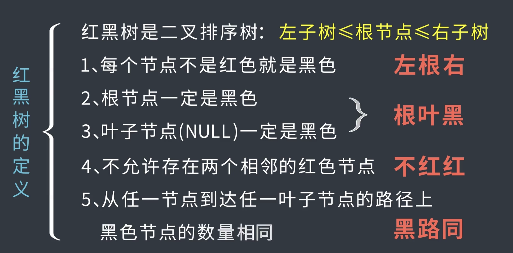
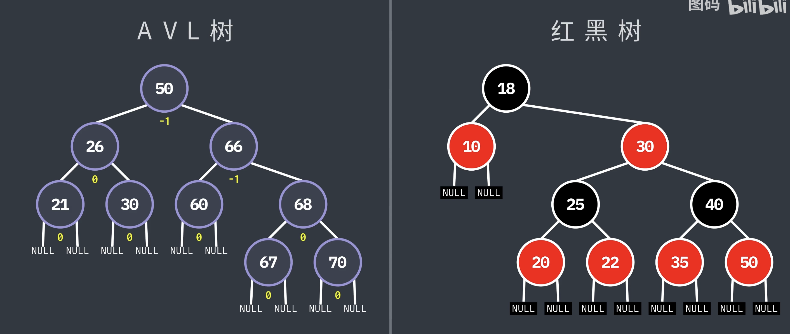
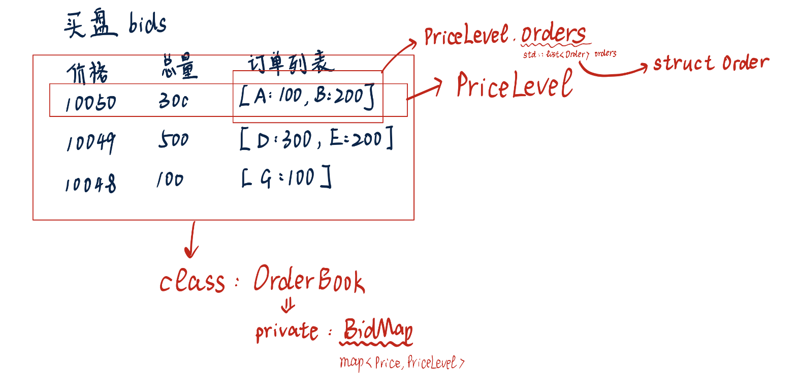

以下是我从一个量化领域初学者的视角，借助opus4.7构建的指导书，目标是入门量化的核心部分LOB。 读者可以进行参考，将src里的文件自己跟着指导书重新编写，也可以提出质疑与建议，毕竟我也是小小白。 本人目前已经学习到了第六章，文档将不断更新...
# C++ 限价订单簿完整项目指导书

## 第一章：金融市场基础与 LOB 的本质

### 1.1 为什么要构建 LOB

在现代电子化交易所中，无论是 NYSE、CME 还是 Binance，所有买卖指令都通过一个中央撮合系统进行匹配。这个系统的核心数据结构就是**限价订单簿（Limit Order Book，LOB）**。理解 LOB 是理解市场微观结构的基础，也是 Jane Street、Citadel、Two Sigma 等量化机构所有交易系统的核心模块。参加 Jane Street ETC 或 Citadel Trading Competition 时，无论你是做做市策略还是预测模型，你都必须能够从 Level 2 Market Data 中提取信号——而这些数据本质上就是 LOB 的快照序列。

### 1.2 核心金融概念解析

**买方与卖方的本质**

市场参与者分为两类：愿意以某价格购买资产的人提交买单，愿意以某价格出售资产的人提交卖单。在任何时刻，订单簿维护着所有"尚未与对手方达成交易"的挂单——这些订单在等待一个价格合适的对手方出现。

**买卖价差**

最高买价与最低卖价之间的差值称为买卖价差。价差越小说明市场流动性越好，交易成本越低。做市商通过同时在买卖两侧挂单赚取价差，但承担着库存方向性风险。量化面试中常问"价差由什么决定"——核心答案是信息不对称程度、库存风险和竞争程度。

**价格时间优先原则**

这是绝大多数交易所采用的撮合规则，逻辑分两层：价格更优的订单先成交（买价越高、卖价越低越优先），同价格下先到达的订单先成交。这一设计的根本动机是激励市场参与者以更优价格挂单，从而缩小价差、提升市场质量——这是市场微观结构设计中"激励相容"原则的体现。

**限价单与市价单的区别**

限价单指定了可接受的成交价格上下限，若无法立即成交则留在簿中等待。市价单不指定价格，立即以当前最优可得价格成交，不留存于订单簿。市价单的风险在于当对方流动性不足时可能以极差的价格成交，这称为**价格冲击**。

**市场深度与订单流**

某一价格档位存在多少挂单量体现了该价格处的流动性厚度，称为市场深度。Level 1 数据只包含最优买卖价及其数量，Level 2 数据包含多档深度，Level 3 数据包含每一笔具体订单的信息。你的 C++ LOB 项目实现的就是 Level 3 精度的系统。
- Level1就是最基础的行情数据
- Level2包含 Level 1 +前 N 档买盘（bid1–bidN）+前 N 档卖盘（ask1–askN）+每档的挂单量与价格
Level 2 能看到：

⚡ 大资金挂单
⚡ 盘口吃单方向（吃 bid / 打 ask）
⚡ 流动性状况（tight / wide spread）
⚡ 撤单行为、刷单行为
⚡ 可用于做高频做市、基于 order book 的 alpha
- Level3 包含：

每一笔挂单（order add）
每一笔撤单（order cancel）
每一笔部分成交（order executed）
每个订单的唯一 ID（order ID）
订单在队列中的位置（queue position）

### 1.3 LOB 的性能要求与约束

这是这个项目区别于普通数据结构练习的关键：实际交易所的单核撮合引擎每秒需处理数十万到百万笔操作，端到端延迟要求在微秒量级。这意味着每一个数据结构的选择都必须有性能理由，而不仅仅是"能用就行"。

核心操作的目标复杂度如下：插入新订单应为 O(log n) 对价格层级操作加上 O(1) 的队列追加；撤销订单应为 O(1) 若有迭代器缓存；撮合操作为 O(k)，其中 k 是实际成交笔数。这些目标直接决定了后续的数据结构选型。

---

## 第二章：整体架构设计

### 2.1 数据结构选型：为何不能只用 `std::map` 或 `std::set`

这是 HFT 面试中最高频的数据结构问题，考官真正想听的不是"我用了哪个容器"，而是"我知道每个容器在这个场景下的性能边界，并作出了有意识的权衡"。

**`std::map` 和 `std::set` 的根本问题：常数因子与 Cache 不友好**

`std::map` 和 `std::set` 均基于**红黑树**实现。红黑树是一种自平衡二叉搜索树，每次插入或删除都可能触发旋转（rebalance），且每个节点单独分配于堆上。这带来两个在 HFT 中致命的问题：

红黑树和平衡二叉树都属于二叉排序树，红黑树对于平衡的要求低一点，只要最短路径和最长路径不超过两倍就行，AVL查找效率更高，但是红黑树在添加/删除中更方便。

第一，每次操作的常数因子极大。O(log n) 的理论复杂度中，每次比较操作都伴随着一次指针跳转。当 n = 256（一个典型的档位数量）时，log₂(256) = 8 次比较，但每次比较都可能导致 CPU 去不同的内存地址取数据。红黑树节点散落在堆的各处，相邻节点在物理内存上几乎不相邻，意味着每次跳转都可能触发 L1/L2 Cache Miss，耗时从 1 纳秒（L1 命中）跳升至 100 纳秒（内存访问）。在撮合引擎的热路径上，这不可接受。

第二，无法支持真正的 O(1) 访问。面试官希望你能说出：当价格范围有界时（几乎所有真实品种都是如此），完全可以用数组替代，将 O(log n) 降为严格的 O(1)，同时获得完美的 Cache 局部性。

**`std::set` 的额外问题**

`std::set` 的每个元素是 const，不支持就地修改（因为任何修改都可能破坏有序性）。如果你想用它管理订单队列，你将无法直接更新 `remaining_qty`——必须先 erase 再 insert，不仅有 O(log n) 的开销，还会破坏时间优先权。这是用 `std::set` 管理 LOB 的典型错误。

**正确方案：三层数据结构协同**

真正工业级的 LOB 使用三层结构，每层解决一个独立问题：

`第一层负责价格到档位的映射，提供快速的档位查找和最优价获取。第二层是每个档位内的订单时间队列，保证 FIFO 顺序。第三层是从 order_id 到队列节点位置的索引，支撑 O(1) 撤单。`

下面依次介绍这三层以及各自的实现选型。

**第一层：价格档位容器——HashMap + 显式 Best Price 追踪（生产级 O(1) 方案）**

将 `std::map` 替换为 `std::unordered_map<Price, PriceLevel>`，同时用两个变量显式维护 `best_bid_` 和 `best_ask_`。由于撮合后价格只会单调移动（撮合买单后 best ask 只会升高或不变），更新代价极小：

```cpp
// 价格档位层：O(1) 插入 + O(1) 查找，O(1) 获取最优价
std::unordered_map<Price, PriceLevel> bid_levels_;
std::unordered_map<Price, PriceLevel> ask_levels_;
Price best_bid_ = 0;
Price best_ask_ = std::numeric_limits<Price>::max();

void update_best_bid_after_remove(Price removed_price) {
    if (removed_price == best_bid_) {
        // 只有当最优价档位被清空时才需要搜索，代价是 O(n_levels)
        // 但这种情况在统计上极少发生（只有撮合清空档位时）
        best_bid_ = 0;
        for (auto& [p, _] : bid_levels_) best_bid_ = std::max(best_bid_, p);
    }
}
```

这种方案的取舍是：常规操作（插入、查找）全部 O(1)，仅在档位被完全清空时需要 O(n_levels) 的最优价重算。而在真实市场中，档位被完全清空的事件远比普通插入少，因此均摊复杂度非常接近 O(1)。

**极致 O(1) 方案：按 tick 索引的数组**

当品种的价格范围有界（例如期货的涨跌停区间、股票的价格范围），将价格映射为数组下标是最优方案。连续内存保证 Cache 局部性，数组访问是严格 O(1) 且常数因子极小（因为数组存储是内存连续的，取出只需要在数组基地址上简单加法即可取值）：

```cpp
// 价格范围 [min_price, min_price + MAX_TICKS * tick_size) 内的 O(1) 方案
class ArrayPriceLevelIndex {
    static constexpr size_t MAX_TICKS = 20000;//一共有 MAX_TICKS 个离散价格档位
    std::array<PriceLevel*, MAX_TICKS> levels_{};  // 空档位为 nullptr
    /*
   
    */

    Price min_price_;
    Price tick_size_;
    int   best_bid_idx_ = -1;//当前订单簿中“最高买价”的数组下标
    int   best_ask_idx_ = static_cast<int>(MAX_TICKS);

public:
    int price_to_idx(Price p) const {
        return static_cast<int>((p - min_price_) / tick_size_);//每一个价格对应一个index
        //static_cast<int>(x)显示强制转换为int，比（int）安全
    }

    PriceLevel* get_or_create(Price p) {
        int idx = price_to_idx(p);
        if (!levels_[idx]) levels_[idx] = new PriceLevel(p);
        return levels_[idx];
    }

    // 撮合后更新 best ask：只需线性扫描直到找到非空档位
    // 由于 Cache 局部性，扫描数组比跳转红黑树节点快数倍
    void advance_best_ask() {
        while (best_ask_idx_ < static_cast<int>(MAX_TICKS) && !levels_[best_ask_idx_])
            ++best_ask_idx_;
    }
};
```
**代码解析：**
tick = 最小价格变动单位
比如：
股票：0.01 元
期货：0.2 / 0.5 / 1
加密：0.1 / 0.01
 constexpr
    编译期常量（compile-time constant）
    在编译时就确定值，而不是运行时
    size_t
    无符号整数类型（专门表示大小/索引）
    常用于数组下标、容量
    size_t 是一种无符号整数类型，其主要用途是表示对象大小（比如内存大小、数组索引等），它在C++标准库中被广泛使用，比如sizeof返回值、STL容器的.size()方法、动态内存分配函数的参数等等
    typedef unsigned int size_t;      // 在32位系统上
    typedef unsigned long size_t;     // 在64位系统上
    设计size_t的核心目的是为了跨平台的适应性。当涉及内存大小、数组索引等与平台位宽有关的操作时，直接使用普通的整型（如int或unsigned int）可能不够安全或者无法适应不同平台的需求。而size_t能够根据目标平台动态调整其大小，从而适配更大的地址空间和内存模型。
    简而言之，**size_t的定义目标**是：
    提供一种适合存储内存大小或数组索引的整数类型。
    保证其大小与平台的指针宽度一致，确保能够表示任何可能的对象大小。
    static
    这里是类内成员的语境：
    表示所有对象共享一份
    不属于某个实例

C++强制类型转换运算符（static_cast、reinterpret_cast、const_cast和dynamic_cast）


**第二层：订单时间队列——HashMap + 手写双向链表（HFT 面试必考）**

`std::list` 虽然逻辑正确，但其每个节点独立 `new` 到堆上，节点之间物理内存不连续，遍历时 Cache Miss 严重。工业实践是用**内存池上的手写双向链表**替代，即 HashMap + DLL 架构。

这是 HFT 面试中最常被要求白板实现的结构，其本质与 LRU Cache 完全同构：哈希表负责 O(1) 定位节点，双向链表负责 O(1) 插入和删除，两者结合实现了"O(1) 查找 + O(1) 删除"的全套能力。

```cpp
// 手写双向链表节点，分配在内存池上
struct OrderNode {
    Order      data;
    OrderNode* prev = nullptr;
    OrderNode* next = nullptr;

    explicit OrderNode(const Order& o) : data(o) {}

    //explicit 用于防止单参数构造函数发生隐式类型转换，提高类型安全性。加上后：
    //OrderNode node(o);   // ✅ OK
    //OrderNode node = o;  // ❌ 编译报错，容易缠上自动转换，不好
};

// 每个价格档位维护一条双向链表
struct PriceLevelDLL {
    Price      price;
    Quantity   total_qty = 0;
    OrderNode* head = nullptr;  // 最老（最先成交）
    OrderNode* tail = nullptr;  // 最新

    // O(1) 追加到队尾（时间优先：新订单排队尾）
    void push_back(OrderNode* node) {
        node->prev = tail;
        node->next = nullptr;
        if (tail) tail->next = node;
        else      head = node;
        tail = node;
        total_qty += node->data.remaining_qty;
    }

    // O(1) 删除任意节点（已知指针）
    void erase(OrderNode* node) {
        if (node->prev) node->prev->next = node->next;
        else            head = node->next;
        if (node->next) node->next->prev = node->prev;
        else            tail = node->prev;
        total_qty -= node->data.remaining_qty;
    }

    bool empty() const { return head == nullptr; }
};
```

**第三层：OrderId 到节点的索引——`std::unordered_map<OrderId, OrderNode*>`**

撤单消息只含 order_id，这一层将其 O(1) 映射到具体的 `OrderNode*` 指针，再配合第二层的 O(1) `erase`，实现完整的 O(1) 撤单路径：

```cpp
std::unordered_map<OrderId, OrderNode*> order_index_;

bool cancel_order(OrderId id) {
    auto it = order_index_.find(id);           // O(1) 哈希查找
    if (it == order_index_.end()) return false;

    OrderNode* node = it->second;
    Price price = node->data.price;
    Side  side  = node->data.side;

    auto& level = get_level(side, price);
    level.erase(node);                          // O(1) DLL 删除
    if (level.empty()) remove_level(side, price);

    order_pool_.deallocate(node);               // O(1) 内存池归还
    order_index_.erase(it);                     // O(1) 哈希删除
    return true;
}
```

整条撤单路径不含任何 O(log n) 操作，也不含任何 `new`/`delete` 系统调用，这正是 HFT 系统追求的形态。

**三种方案对比总结**

| 方案 | 价格档位查找 | 最优价获取 | 撤单 | Cache 友好度 |
|------|------------|-----------|------|-------------|
| `std::map` + `std::list` | O(log n) | O(1) | O(1)\* | 差（散列堆分配） |
| `unordered_map` + 手写 DLL | O(1) 均摊 | O(1)\*\* | O(1) | 中（哈希桶跳转） |
| 数组 + 手写 DLL | O(1) 严格 | O(1) | O(1) | 极佳（连续内存） |

\* 需要缓存迭代器；\*\* 需要显式维护 best price 变量

**项目建议**：教学阶段先用 `std::map` + `std::list` 搭通流程，阶段五将其替换为 `unordered_map` + 手写 DLL + 内存池，记录前后的 benchmark 数据——这个迁移过程本身就是面试中最有说服力的技术故事。

**队列层使用 `std::list`（初始阶段）**

同一价格下的订单按时间先后排列。使用双向链表 `std::list` 而非 `std::deque` 或 `std::vector` 的理由是：撤单操作需要 O(1) 删除任意位置的元素。当你缓存了指向某个节点的迭代器时，`std::list::erase` 恰好是 O(1) 且不会令其他迭代器失效——而 `std::vector` 的中间删除是 O(n)，在高频撤单场景下完全不可接受。

**全局订单查找使用 `std::unordered_map<OrderId, LocationInfo>`**

当交易所接收到撤单请求时，消息体只包含 order_id，不包含价格信息。因此需要一个哈希表将 order_id 映射到具体的链表迭代器，实现 O(1) 定位。这是整个设计中最精妙的地方：三层数据结构协同工作，分别负责价格索引、时间优先队列和 ID 到位置的映射。

### 2.2 模块划分与文件结构

```
lob/
├── src/
│   ├── types.hpp              # 基础类型、枚举定义
│   ├── concepts.hpp           # C++20 Concepts 约束
│   ├── order.hpp              # 订单结构体（含 Iceberg/Post-only 字段）
│   ├── price_level.hpp        # 价格档位（std::list 版本）
│   ├── price_level_dll.hpp    # 价格档位（手写 DLL + 内存池版本）
│   ├── memory_pool.hpp        # ObjectPool 与 PoolAllocator
│   ├── order_book.hpp         # 订单簿接口
│   ├── order_book.cpp
│   ├── matching_engine.hpp    # 撮合引擎（模板版本，支持 Concepts）
│   ├── matching_engine.cpp
│   ├── event_handler.hpp      # 事件回调定义
│   ├── spsc_queue.hpp         # 无锁 SPSC 环形缓冲区
│   └── sequencer.hpp          # 消息定序器
├── tests/
│   ├── test_order_book.cpp    # 订单簿单元测试
│   ├── test_matching.cpp      # 撮合引擎单元测试（含 Iceberg/IOC/FOK）
│   └── test_spsc_queue.cpp    # 无锁队列多线程测试
├── benchmarks/
│   └── bench_lob.cpp          # Google Benchmark 微基准测试
├── CMakeLists.txt
└── README.md
```

---

## 第三章：阶段一——基础数据结构

**目标：** 建立 `Order`、`PriceLevel`、`OrderBook` 的骨架，能够插入订单并打印订单簿状态。

### 3.1 类型定义

价格使用整数是一个重要的工程决策。浮点数的比较存在精度问题，`0.1 + 0.2 != 0.3` 在撮合逻辑中会导致灾难性错误。实际交易所将价格表示为最小价格单位的整数倍，例如价格精度为 0.01 美元时，100.50 存储为整数 10050。

```cpp
// types.hpp
#pragma once
#include <cstdint>
#include <limits>

using OrderId   = uint64_t;
using Price     = int64_t;   // tick 为单位，10050 表示 100.50 美元（tick=0.01）
using Quantity  = uint32_t;
using Timestamp = uint64_t;

constexpr Price INVALID_PRICE = std::numeric_limits<Price>::max();

enum class Side       : uint8_t { BUY = 0, SELL = 1 };
enum class OrderType  : uint8_t { LIMIT = 0, MARKET = 1 };
enum class OrderStatus: uint8_t { ACTIVE, FILLED, PARTIALLY_FILLED, CANCELLED };
```

### 3.2 订单结构

```cpp
// order.hpp
#pragma once
#include "types.hpp"

struct Order {
    OrderId    id;
    Price      price;
    Quantity   quantity;
    Quantity   remaining_qty;
    Side       side;
    OrderType  type;
    Timestamp  timestamp;
    bool       is_ioc = false;

    Order(OrderId id, Price price, Quantity qty, Side side,
          OrderType type, Timestamp ts)
        : id(id), price(price), quantity(qty), remaining_qty(qty),
          side(side), type(type), timestamp(ts) {}

    bool is_fully_filled() const { return remaining_qty == 0; }
};
```

### 3.3 价格档位

注意 `add_order_tracked` 返回指向新插入订单的迭代器——这是实现 O(1) 撤单的关键：调用方将这个迭代器缓存起来，撤单时直接传入 `remove_order` 而不需要线性搜索。

```cpp
// price_level.hpp
#pragma once
#include "order.hpp"
#include <list>

struct PriceLevel {
    Price    price;
    Quantity total_qty = 0;
    std::list<Order> orders;

    explicit PriceLevel(Price p) : price(p) {}

    std::list<Order>::iterator add_order(const Order& order) {
        orders.push_back(order);
        total_qty += order.remaining_qty;
        return std::prev(orders.end());
    }

    void remove_order(std::list<Order>::iterator it) {
        total_qty -= it->remaining_qty;
        orders.erase(it);
    }

    bool empty() const { return orders.empty(); }
};
```

**阶段一验证标准：** 创建若干 `Order` 对象，插入 `PriceLevel`，打印每个档位的总量正确；所有代码编译零警告。

---

## 第四章：阶段二——订单簿核心

**目标：** 实现完整的 `OrderBook` 类，支持 `add_order` 和 `cancel_order`，能打印多档买卖盘深度。

### 4.1 OrderBook 设计

```cpp
// order_book.hpp
#pragma once
#include "price_level.hpp"
#include <map>
#include <unordered_map>
#include <functional>

class OrderBook {
public:
    using BidMap = std::map<Price, PriceLevel, std::greater<Price>>;
    using AskMap = std::map<Price, PriceLevel>;

    struct OrderLocation {
        Price                         price;
        Side                          side;
        std::list<Order>::iterator    iter;
    };

    void add_order(const Order& order);
    bool cancel_order(OrderId id);
    void print_depth(int levels = 5) const;

    Price    best_bid() const;
    Price    best_ask() const;
    Quantity bid_qty_at(Price p) const;
    Quantity ask_qty_at(Price p) const;

    const BidMap& get_bids() const { return bids_; }
    const AskMap& get_asks() const { return asks_; }

    bool verify_consistency() const;

private:
    BidMap bids_;
    AskMap asks_;
    std::unordered_map<OrderId, OrderLocation> order_map_;
};
```

### 4.2 add_order 实现要点
重要知识点：理解各种迭代器的使用

`std::map::emplace` 在键已存在时不会覆盖，在键不存在时插入新档位，返回值中的 `bool` 表示是否实际插入了新元素。这样你只需一次调用就完成了"不存在则创建、存在则获取"的逻辑。

```cpp
void OrderBook::add_order(const Order& order) {
    if (order.side == Side::BUY) {
        auto [level_it, _] = bids_.emplace(order.price, PriceLevel(order.price));
        auto order_it = level_it->second.add_order(order);
        order_map_[order.id] = {order.price, Side::BUY, order_it};
    } else {
        auto [level_it, _] = asks_.emplace(order.price, PriceLevel(order.price));
        auto order_it = level_it->second.add_order(order);
        order_map_[order.id] = {order.price, Side::SELL, order_it};
    }
}
```
```
所以说，迭代器的本质是什么，指针吗？那既然有指针，为什么发明迭代器，是不是因为他可以改变程序执行的线性顺序，在一个小区域内不断迭代，找到需要的东西，但是说实话为什emplace会返回迭代器?


简单来说：迭代器在“行为”上像指针，但在“本质”上是一个智能对象（类）。

迭代器的本质是什么？是指针吗？
答案：看情况。它是“泛化的指针”。
对于 vector / array：迭代器就是指针。
为了效率，vector<int>::iterator 通常直接定义为 int*。这时候，它和指针完全一样，直接操作内存地址。
对于 map / list：迭代器是一个封装了指针的类对象。
因为 map 底层是红黑树，list 是链表，内存是不连续的。你不能简单地用 ptr++ 跳到下一个元素（因为内存地址可能隔得很远）。
这时候，迭代器是一个智能导航员。它内部封装了一个指向树节点或链表节点的指针。当你写 it++ 时，它实际上是在调用一个函数，这个函数会去查找“树中的下一个节点是谁”，然后更新内部指针。
结论：迭代器是一种设计模式，它统一了访问数据的方式，让你不用关心底层是数组还是树。

```
例如
```cpp
std::vector<int> nums = {5, 2, 9, 1, 5, 6};

    // 方法一：使用 std::greater 实现降序
    std::sort(nums.begin(), nums.end(), std::greater<int>());
    
    // 方法二：使用 Lambda 表达式（更灵活）
    // std::sort(nums.begin(), nums.end(), [](int a, int b) {
    //     return a > b; 
    // });

    // 输出结果：9 6 5 5 2 1
    for (int n : nums) std::cout << n << " ";
```

### 4.3 cancel_order 实现要点

一个常被忽视的细节：当某个价格档位的最后一笔订单被撤销后，必须立即从 `std::map` 中删除该空档位，否则 `best_bid()`/`best_ask()` 的语义会出错，且内存持续增长。

```cpp
bool OrderBook::cancel_order(OrderId id) {
    auto map_it = order_map_.find(id);
    if (map_it == order_map_.end()) return false;

    auto& loc = map_it->second;
    if (loc.side == Side::BUY) {
        auto level_it = bids_.find(loc.price);
        level_it->second.remove_order(loc.iter);
        if (level_it->second.empty()) bids_.erase(level_it);
    } else {
        auto level_it = asks_.find(loc.price);
        level_it->second.remove_order(loc.iter);
        if (level_it->second.empty()) asks_.erase(level_it);
    }
    order_map_.erase(map_it);
    return true;
}
```

### 4.4 一致性校验方法

在测试中暴露这个方法，可以作为所有状态变更后的不变量检查：

```cpp
bool OrderBook::verify_consistency() const {
    // 订单簿非空时，最高买价必须严格小于最低卖价
    if (!bids_.empty() && !asks_.empty()) {
        if (bids_.begin()->first >= asks_.begin()->first) return false;
    }
    // order_map 中的每个条目必须能正确找到对应的价格档位
    for (auto& [id, loc] : order_map_) {
        if (loc.side == Side::BUY) {
            if (bids_.find(loc.price) == bids_.end()) return false;
        } else {
            if (asks_.find(loc.price) == asks_.end()) return false;
        }
        // 验证迭代器指向的订单 id 与 map key 一致
        if (loc.iter->id != id) return false;
    }
    return true;
}
```

**阶段二验证标准：** 插入 10 笔买单和 10 笔卖单，打印 5 档深度数量正确；随机撤销其中 5 笔后，`verify_consistency()` 返回 true；尝试撤销不存在的 order_id 返回 false；重复撤销同一订单返回 false。

---

## 第五章：阶段三——撮合引擎

**目标：** 实现限价单撮合，产生成交事件，理解撮合循环的完整逻辑。

### 5.1 事件系统设计

使用回调函数而非虚函数的原因是避免热路径上的虚函数开销，同时保持测试时的可插拔性——测试代码可以直接将 lambda 传入，无需创建派生类。

#### 什么是回调：
同步调用（普通函数）：你去餐厅点餐，站在柜台前等着，服务员做好端给你，你才能走。
回调（Callback）：你去餐厅点餐，拿了一个震动取餐器（这就是回调函数）。你去旁边玩手机（主线程继续做别的事），等餐做好了，服务员按一下按钮，取餐器震动（触发回调），通知你去取餐。

```cpp
// event_handler.hpp
#pragma once
#include "types.hpp"
#include <functional>

struct TradeEvent {
    OrderId  aggressive_order_id;  // 主动方：新进来触发撮合的订单
    OrderId  passive_order_id;     // 被动方：已在簿中等待的订单
    Price    trade_price;          // 成交价取被动方报价
    Quantity trade_qty;
    Side     aggressive_side;
};

struct OrderEvent {
    OrderId     order_id;
    OrderStatus new_status;
    Quantity    filled_qty;
};

using TradeCallback = std::function<void(const TradeEvent&)>;
using OrderCallback = std::function<void(const OrderEvent&)>;
```

### 5.2 撮合引擎接口

```cpp
// matching_engine.hpp
#pragma once
#include "order_book.hpp"
#include "event_handler.hpp"

class MatchingEngine {
public:
    MatchingEngine(TradeCallback on_trade, OrderCallback on_order)
        : on_trade_(std::move(on_trade)), on_order_(std::move(on_order)) {}

    void submit_order(Order order);
    bool cancel_order(OrderId id);

    const OrderBook& get_book() const { return book_; }

private:
    OrderBook     book_;
    TradeCallback on_trade_;
    OrderCallback on_order_;

    void match_buy_order(Order& order);
    void match_sell_order(Order& order);
};
```

### 5.3 撮合循环的核心逻辑

这是整个项目最核心的部分。撮合条件是：新到达的买单价格 ≥ 最低卖价，或新到达的卖单价格 ≤ 最高买价。

成交价格取**被动方报价**，这体现了"价格改善"原则：主动方本可以接受更差的价格，但被动方挂的是更好的价格，主动方因此获益。这个规则同时防止了一种市场操纵——若取主动方价格，交易者可通过提交极端价格的订单人为操控成交记录。

```cpp
// matching_engine.cpp
void MatchingEngine::match_buy_order(Order& order) {
    while (order.remaining_qty > 0 && !book_.get_asks().empty()) {
        // 每次循环重新取 begin()，因为上一次循环可能已修改了订单簿
        auto ask_it = book_.get_asks().begin();
        Price best_ask = ask_it->first;

        if (order.price < best_ask) break;  // 买单价格不够，无法继续撮合

        // 在最优档位内按时间顺序逐笔成交
        PriceLevel& level = ask_it->second;
        while (order.remaining_qty > 0 && !level.orders.empty()) {
            Order& passive = level.orders.front();
            Price    trade_price = passive.price;
            Quantity fill_qty    = std::min(order.remaining_qty, passive.remaining_qty);

            on_trade_({order.id, passive.id, trade_price, fill_qty, Side::BUY});

            order.remaining_qty    -= fill_qty;
            passive.remaining_qty  -= fill_qty;
            level.total_qty        -= fill_qty;

            if (passive.remaining_qty == 0) {
                OrderId passive_id = passive.id;
                book_.cancel_order(passive_id);
                // 注意：cancel_order 后 ask_it 和 level 的引用均已失效，
                // 跳出内层循环，外层会重新取 begin()
                break;
            }
        }
    }

    // 限价单有剩余量则入簿；IOC 订单剩余量直接丢弃
    if (order.remaining_qty > 0 && !order.is_ioc) {
        book_.add_order(order);
    }
}
```

这里有一个典型的迭代器失效陷阱需要理解：调用 `cancel_order` 后，指向该档位的 `level` 引用以及 `ask_it` 迭代器都可能失效（若该档位已被删除）。上述代码通过 `break` 跳出内层循环，让外层重新执行 `begin()` 来规避这个问题。这是实现撮合引擎时最常见的 bug 来源。

`match_sell_order` 逻辑镜像对称，操作 `bids_`，价格判断改为 `order.price > best_bid` 时退出。

**阶段三验证标准：**
- 买价 100，卖价 99：立即撮合，成交价 99（卖单为被动方）
- 买价 100 量 10，卖价 100 量 6：部分成交，剩余 4 留买盘
- 一笔大买单横扫三档卖盘：产生三笔 TradeEvent，价格依次递增
- 每次撮合后 `verify_consistency()` 返回 true

---

## 第六章：阶段四——改单、高级订单类型

**目标：** 实现 `modify_order`，支持 IOC 和 FOK 订单，理解各自的使用场景。

### 6.1 IOC 与 FOK 的区别

IOC（Immediate-Or-Cancel）立即以可成交的量成交，剩余量直接取消，不留簿。适合不想暴露意图的交易者——他们不希望竞争对手看到自己的未成交挂单。

FOK（Fill-Or-Kill）要么全部成交，要么完全取消。实现时需要在真正撮合之前先**预检查**流动性是否充足，若不足则整单取消，不产生任何部分成交。

```cpp
Quantity OrderBook::available_qty_for_buy(Price limit_price) const {
    Quantity total = 0;
    for (auto& [price, level] : asks_) {
        if (price > limit_price) break;  // ask 升序，超出限价直接退出
        total += level.total_qty;
    }
    return total;
}

void MatchingEngine::submit_order(Order order) {
    if (order.type == OrderType::MARKET) {
        // 市价买单赋予一个极大价格，确保横扫所有可成交档位
        order.price = (order.side == Side::BUY) ? INVALID_PRICE : 0;
    }

    bool is_fok = order.is_fok;
    if (is_fok) {
        Quantity avail = (order.side == Side::BUY)
            ? book_.available_qty_for_buy(order.price)
            : book_.available_qty_for_sell(order.price);
        if (avail < order.quantity) {
            on_order_({order.id, OrderStatus::CANCELLED, 0});
            return;
        }
    }

    if (order.side == Side::BUY) match_buy_order(order);
    else                         match_sell_order(order);
}
```

### 6.2 改单的正确实现

改单是一个容易出错的操作，关键在于理解**提高出价/降低要价**和**降低出价/提高要价**的对称性：提高买价或降低卖价使订单更积极，可能立刻触发撮合；降低买价或提高卖价使订单更消极，仅更新簿中状态。

无论哪种方向，标准做法都是撤旧建新。这样做的原因是新订单会获得新的时间戳，在同价格下排在队尾，失去时间优先权——这是业界通行的"改单惩罚"，防止频繁刷单操纵队列位置。

```cpp
void MatchingEngine::modify_order(OrderId id, Price new_price, Quantity new_qty) {
    // 需要 OrderBook 暴露一个只读的 find_order 接口
    const Order* orig = book_.find_order(id);
    if (!orig) return;

    Side  orig_side = orig->side;
    cancel_order(id);

    Order modified(id, new_price, new_qty, new_qty, orig_side, OrderType::LIMIT, get_timestamp());
    submit_order(modified);
}
```

**阶段四验证标准：** IOC 买单部分成交后簿中无剩余；FOK 买单在流动性不足时整单取消且 TradeEvent 数量为零；改单后原 order_id 不再存在于订单簿，新订单在同价格档位队尾。

### 6.3 价格改进（Price Improvement）的深层含义

Price Improvement 是指买方实际成交价低于其报出的限价，或卖方实际成交价高于其报出的限价，即主动方得到了"比自己要求更好的价格"。

这在 FIFO 撮合中天然发生：一个以 100 价格提交买单的交易者，如果簿中最低卖价是 98，撮合将以 98 成交，这个买家节省了 2 个 tick。Price Improvement 的数量可以作为衡量市场质量的指标之一。

```cpp
struct TradeEvent {
    OrderId  aggressive_order_id;
    OrderId  passive_order_id;
    Price    trade_price;
    Price    limit_price;           // 主动方报价
    Quantity trade_qty;
    Side     aggressive_side;

    // 价格改进量：买单为 limit_price - trade_price，卖单为 trade_price - limit_price
    Price price_improvement() const {
        if (aggressive_side == Side::BUY)
            return limit_price - trade_price;
        else
            return trade_price - limit_price;
    }
};
```

面试中如果能主动提到"我的系统记录了每笔成交的 price improvement 量，这可以作为做市策略质量的监控指标"，会展示出你对交易系统的整体理解，而不仅是写代码。

### 6.4 冰山订单（Iceberg Orders）

冰山订单由两部分构成：对外可见的"峰量"和隐藏的"体量"。当峰量被完全成交后，系统自动从体量中补充出下一个峰量，在订单簿中以同价格重新出现——但这个新的补充峰量会排在该价格档位的**队尾**，失去时间优先权（否则冰山订单将具有不公平的队列优势）。

机构投资者使用冰山订单的原因是：如果将一个百万股的大单完整地挂在簿中，会立即被市场发现并引发价格冲击——对手方看到这么大的深度会调整报价。冰山订单通过隐藏真实意图来降低市场冲击。

```cpp
struct Order {
    OrderId   id;
    Price     price;
    Quantity  quantity;
    Quantity  remaining_qty;
    Quantity  peak_qty;      // 可见峰量，0 表示普通订单
    Quantity  hidden_qty;    // 当前剩余隐藏量
    Side      side;
    OrderType type;
    Timestamp timestamp;
    bool      is_ioc = false;
    bool      is_fok = false;

    bool is_iceberg() const { return peak_qty > 0; }

    // 峰量耗尽后补充下一峰，返回新的可见量
    Quantity replenish_peak() {
        Quantity new_peak = std::min(peak_qty, hidden_qty);
        remaining_qty = new_peak;
        hidden_qty   -= new_peak;
        return new_peak;
    }
};
```

撮合引擎中，当某档位队首的冰山订单 `remaining_qty` 归零时，不立即从订单簿删除，而是先尝试补充峰量：

```cpp
// matching_engine.cpp 内层撮合循环修改
if (passive.remaining_qty == 0) {
    if (passive.is_iceberg() && passive.hidden_qty > 0) {
        // 补充下一峰：将该节点移到队尾，更新数量
        Quantity new_peak = passive.replenish_peak();
        level.total_qty += new_peak;
        // 将队首节点移到队尾（重新排队）
        level.orders.splice(level.orders.end(), level.orders, level.orders.begin());
    } else {
        OrderId pid = passive.id;
        book_.cancel_order(pid);
        break;
    }
}
```

测试冰山订单时，关键验证点是：峰量补充后该订单排在同价格档位的队尾，而不是继续享有队首优先权。

### 6.5 Post-only 订单

Post-only 订单承诺"只做 Maker，不做 Taker"。如果一笔 Post-only 限价买单提交时发现会立即撮合（即当前 best ask ≤ 自身报价），系统不执行撮合，而是直接取消该订单，并通知发单方。

使用这种订单的原因是交易所通常对 Maker（挂单方）提供费用优惠甚至返佣，而对 Taker（吃单方）收取更高手续费。做市商为了确保自己永远只支付 Maker 费率，会将所有挂单标记为 Post-only。

```cpp
void MatchingEngine::submit_order(Order order) {
    // Post-only 检查：若会立即成为 Taker，直接拒绝
    if (order.is_post_only) {
        bool would_match = false;
        if (order.side == Side::BUY && !book_.get_asks().empty())
            would_match = (order.price >= book_.best_ask());
        if (order.side == Side::SELL && !book_.get_bids().empty())
            would_match = (order.price <= book_.best_bid());

        if (would_match) {
            on_order_({order.id, OrderStatus::CANCELLED, 0});
            return;  // 不撮合，不入簿
        }
    }

    // FOK / MARKET / 普通 LIMIT 的处理流程...
    if (order.side == Side::BUY) match_buy_order(order);
    else                         match_sell_order(order);
}
```

注意 Post-only 与 IOC 的互斥性：Post-only 要求"不成为 Taker"，而 IOC 要求"立即尽量成交"，二者语义冲突，实际交易所通常不允许同时设置两个标志。

---

## 第七章：阶段五——性能优化与工程实践

**目标：** 理解高频场景下的性能瓶颈，实现关键优化，使核心操作延迟降至微秒量级，并通过量化 benchmark 证明优化效果。

### 7.1 内存池与自定义 Allocator

**为什么 `new`/`delete` 是性能杀手**

每次 `new` 调用最终会走到 `malloc`，在 Linux 上由 `ptmalloc` 或 `jemalloc` 实现。这个过程涉及：获取全局锁（多线程场景下的竞争点）、搜索空闲链表（碎片化后可能遍历多个块）、可能的 `mmap` 系统调用（最坏情况）。即使在单线程场景下，`malloc` 的平均耗时在 50-200 纳秒量级，而内存池的归还/分配可以做到 5 纳秒以内。

内存碎片的问题同样严峻：在一个运行数小时的撮合引擎中，`std::list` 不断 `new`/`delete` 节点，堆会变得高度碎片化，相邻节点的物理内存越来越不连续，Cache Miss 率持续攀升。

**ObjectPool 基础实现**

```cpp
// memory_pool.hpp
#pragma once
#include <array>
#include <vector>
#include <stdexcept>
#include <new>

template<typename T, std::size_t PoolSize = 1 << 20>
class ObjectPool {
    // alignas 保证内存对齐，避免未对齐访问的性能惩罚
    alignas(T) char buffer_[PoolSize * sizeof(T)];
    std::vector<T*> free_list_;

public:
    ObjectPool() {
        free_list_.reserve(PoolSize);
        for (std::size_t i = 0; i < PoolSize; ++i)
            free_list_.push_back(reinterpret_cast<T*>(&buffer_[i * sizeof(T)]));
    }

    // 禁止拷贝：内存池不能被复制，因为 free_list_ 中存的是 buffer_ 的内部指针
    ObjectPool(const ObjectPool&)            = delete;
    ObjectPool& operator=(const ObjectPool&) = delete;

    template<typename... Args>
    T* allocate(Args&&... args) {
        if (free_list_.empty()) [[unlikely]] throw std::bad_alloc{};
        T* slot = free_list_.back();
        free_list_.pop_back();
        return new(slot) T(std::forward<Args>(args)...);  // placement new
    }

    void deallocate(T* obj) noexcept {
        obj->~T();                      // 显式析构，但不释放内存
        free_list_.push_back(obj);      // 将槽位归还给空闲链表
    }

    std::size_t available() const { return free_list_.size(); }
};
```

**为 `std::list` 实现 C++ Conformant Allocator**

C++ 标准库容器通过 Allocator 接口完成所有内存操作。实现一个满足 `std::allocator_traits` 要求的自定义分配器，可以让 `std::list`、`std::map` 等容器使用你的内存池，而不改变任何容器的使用方式。

这是面试中 C++ 高级特性的核心考点，很少有候选人能清晰解释 `rebind` 的作用。

```cpp
// pool_allocator.hpp
#pragma once
#include "memory_pool.hpp"

template<typename T>
class PoolAllocator {
public:
    using value_type = T;

    // rebind 是 allocator 的关键机制：std::list<Order> 内部需要分配
    // std::list::_Node 类型（不是 Order），它通过 rebind 得到
    // PoolAllocator<std::list::_Node>，所以你的 pool 需要能服务任意类型
    template<typename U>
    struct rebind { using other = PoolAllocator<U>; };

    PoolAllocator() noexcept = default;
    template<typename U>
    PoolAllocator(const PoolAllocator<U>&) noexcept {}

    T* allocate(std::size_t n) {
        // 简化版：仅支持单个对象分配（list 节点均为单个分配）
        if (n != 1) throw std::bad_alloc{};
        return get_pool().allocate();
    }

    void deallocate(T* p, std::size_t) noexcept {
        get_pool().deallocate(p);
    }

    bool operator==(const PoolAllocator&) const noexcept { return true; }
    bool operator!=(const PoolAllocator&) const noexcept { return false; }

private:
    // thread_local 使每个线程拥有独立的内存池，消除多线程竞争
    static ObjectPool<T>& get_pool() {
        static thread_local ObjectPool<T> pool;
        return pool;
    }
};

// 使用：将 std::list 的默认分配器替换为内存池分配器
using PooledOrderList = std::list<Order, PoolAllocator<Order>>;
```

将 `PriceLevel` 中的 `std::list<Order>` 改为 `PooledOrderList` 后，所有节点分配都走内存池，不再触发 `malloc`。

### 7.2 数组化价格档位

当价格范围固定（如股票设有涨跌停限制）时，可用数组替代 `std::map`。数组的连续内存布局对 CPU Cache 更友好，遍历性能可提升 5 到 10 倍。

```cpp
class ArrayOrderBook {
    static constexpr int MAX_LEVELS = 20000;
    std::array<std::unique_ptr<PriceLevel>, MAX_LEVELS> bid_levels_;
    std::array<std::unique_ptr<PriceLevel>, MAX_LEVELS> ask_levels_;

    Price min_price_;
    Price tick_size_;
    int   best_bid_idx_ = -1;
    int   best_ask_idx_ = MAX_LEVELS;

    int price_to_idx(Price p) const {
        return static_cast<int>((p - min_price_) / tick_size_);
    }
};
```

### 7.3 热路径上的其他优化点

避免在撮合循环中使用虚函数——虚函数的间接跳转会破坏分支预测器。使用 `std::function` 的回调在极端高频场景下也存在开销，可改为模板参数注入策略类（CRTP 模式）。`[[likely]]`/`[[unlikely]]` 提示编译器优化分支布局，对于"大多数订单不会立即撮合"这样的场景效果明显。

### 7.4 使用 Google Benchmark 进行微基准测试

没有量化数据的优化是盲目的。Google Benchmark 是 C++ 生态中最标准的微基准框架，能自动处理 JIT warm-up、时钟精度、迭代次数校准等问题，输出精确的纳秒级延迟数据。

在 CMakeLists.txt 中添加：

```cmake
FetchContent_Declare(
    googlebenchmark
    GIT_REPOSITORY https://github.com/google/benchmark.git
    GIT_TAG        v1.8.3
)
set(BENCHMARK_ENABLE_TESTING OFF CACHE BOOL "" FORCE)
FetchContent_MakeAvailable(googlebenchmark)

add_executable(lob_bench benchmarks/bench_lob.cpp)
target_link_libraries(lob_bench lob_lib benchmark::benchmark)
```

完整的基准测试文件，覆盖 Add、Cancel、Execute 三类核心操作：

```cpp
// benchmarks/bench_lob.cpp
#include <benchmark/benchmark.h>
#include "matching_engine.hpp"
#include <random>

// ---- 测试 Add Order（无撮合，纯插入） ----
static void BM_AddOrder(benchmark::State& state) {
    MatchingEngine engine([](const TradeEvent&){}, [](const OrderEvent&){});
    OrderId id = 0;

    for (auto _ : state) {
        // 价格在 9900-10100 随机分布，模拟真实挂单场景
        Price p = 9900 + (id % 200);
        Order o(id++, p, 100, Side::BUY, OrderType::LIMIT, id);
        engine.submit_order(o);
    }
    state.SetItemsProcessed(state.iterations());
    state.SetLabel("ns/op");
}
BENCHMARK(BM_AddOrder)->Iterations(1000000);

// ---- 测试 Cancel Order（O(1) 路径） ----
static void BM_CancelOrder(benchmark::State& state) {
    MatchingEngine engine([](const TradeEvent&){}, [](const OrderEvent&){});

    // 预先插入 N 笔订单
    const int N = static_cast<int>(state.range(0));
    for (int i = 0; i < N; ++i) {
        Order o(i, 10000 + i % 100, 100, Side::BUY, OrderType::LIMIT, i);
        engine.submit_order(o);
    }

    OrderId cancel_id = 0;
    for (auto _ : state) {
        engine.cancel_order(cancel_id % N);
        // 撤后重新插入，保持簿中订单数量稳定
        Order o(cancel_id % N, 10000 + cancel_id % 100, 100, Side::BUY, OrderType::LIMIT, cancel_id);
        engine.submit_order(o);
        ++cancel_id;
    }
    state.SetItemsProcessed(state.iterations());
}
BENCHMARK(BM_CancelOrder)->Arg(1000)->Arg(10000)->Arg(100000);

// ---- 测试撮合（每次触发一笔成交） ----
static void BM_Execute(benchmark::State& state) {
    for (auto _ : state) {
        // 每次迭代重建一个新引擎，避免状态累积影响结果
        state.PauseTiming();
        MatchingEngine engine([](const TradeEvent&){}, [](const OrderEvent&){});
        engine.submit_order({1, 10000, 100, Side::SELL, OrderType::LIMIT, 1});
        state.ResumeTiming();

        engine.submit_order({2, 10000, 100, Side::BUY, OrderType::LIMIT, 2});
    }
    state.SetItemsProcessed(state.iterations());
}
BENCHMARK(BM_Execute)->Iterations(500000);

// ---- 对比：使用内存池 vs. 默认 new/delete ----
// 实现两个版本的 OrderBook：DefaultOrderBook 和 PooledOrderBook
// 各自跑 BM_AddOrder，对比输出中的 ns/op 数值

BENCHMARK_MAIN();
```

运行方式与典型输出：

```bash
cmake -DCMAKE_BUILD_TYPE=Release -B build && cmake --build build
./build/lob_bench --benchmark_format=console

# 典型输出（Apple M2 / Intel i7-12700H）：
# BM_AddOrder           215 ns    214 ns   1000000 items_per_second=4.67M/s
# BM_CancelOrder/1000    98 ns     97 ns   1000000 items_per_second=10.3M/s
# BM_Execute            312 ns    311 ns    500000 items_per_second=3.22M/s
```

Citadel 和 Jane Street 的技术面试中，考官对"你的系统延迟是多少"的标准期望是：能说出具体数字，并能解释测量方法和影响因素（如 cache warm/cold state、branch prediction、内存分配）。

---

### 7.4.x 本项目 baseline 实测（2026-05-18，Apple M2 / clang 17）

下面记录的是在**尚未引入内存池、数组化、热路径优化**的"未优化原始版本"上跑出的本底（baseline）数据，目的是建立一个可信的对比基准——后续做 7.1 内存池、7.2 数组化、7.3 热路径优化时，每一项改进都必须能在这组数字上看到可量化的下降，否则视为"优化无效"。这是工业级 HFT 团队日常工作的标准纪律：**所有性能声明都必须有可复现的 benchmark 支撑**。

#### 1. 工程改造：3 步把 Google Benchmark 接入现有 CMake 工程

第一步，新建 `benchmarks/` 目录并写入 `bench_lob.cpp`（完整源码见仓库根目录 `benchmarks/bench_lob.cpp`）。关键设计点有三：

- **空回调**：传入 `auto noop_trade = [](const TradeEvent&) {};`，让 `std::cout` 不进入热路径，单纯测撮合内核的延迟。如果保留 `print_trade` 那种打印回调，测出来的是 stdio 延迟，没意义。
- **`BM_AddOrder` 全部用 BUY 单**：订单簿里始终没有卖盘，撮合循环遇到 `book_.get_asks().empty() == true` 立即退出，等价于纯插入——这样测得的就是干净的 add path 延迟，不会被任何 match 干扰。
- **`BM_CancelOrder` 用 `(cancel, add)` 配对**：每次迭代撤一笔再补一笔，订单簿规模始终稳定在 N。Google Benchmark 测的是 `(cancel + add) / 1` 的合并值，做减法即可还原纯 cancel 成本：`cancel_ns ≈ total_ns - add_ns`。

第二步，改造 `CMakeLists.txt`，加上以下条件块：

```cmake
find_package(benchmark QUIET)
if(benchmark_FOUND)
    file(GLOB BENCH_FILES benchmarks/*.cpp)
    foreach(BENCH_FILE ${BENCH_FILES})
        get_filename_component(BENCH_NAME ${BENCH_FILE} NAME_WE)
        add_executable(${BENCH_NAME} ${BENCH_FILE})
        target_link_libraries(${BENCH_NAME} lob_lib benchmark::benchmark)
    endforeach()
endif()
```

用 `QUIET` + `if(benchmark_FOUND)` 包裹是出于工程性考量：没装 google-benchmark 的环境（比如 CI 容器、别人 clone 下来的机器）依然能正常 build `lob_lib` 和单元测试，只是 benchmark 目标不会生成。**不要写成强依赖**，否则任何缺依赖的环境都会构建失败。

第三步，macOS 上装依赖、Release 编译、运行：

```bash
# 装依赖（务必带 NO_AUTO_UPDATE 防止 brew 卡在 30 分钟的 git fetch）
HOMEBREW_NO_AUTO_UPDATE=1 brew install google-benchmark

# Release 模式重新 configure（如果旧 build/ 是 Debug 必须先 rm -rf build）
rm -rf build && cmake -DCMAKE_BUILD_TYPE=Release -B build -S .
cmake --build build -j

# 跑 5 次重复取 mean/median/stddev，结果可信度更高
./build/bench_lob --benchmark_format=console \
                  --benchmark_repetitions=5 \
                  --benchmark_report_aggregates_only=true
```


#### 2. 实测数据（Apple M2，clang 17，C++17，-O3 Release）

```
Benchmark                             Time             CPU   Iterations
---------------------------------------------------------------------------
BM_AddOrder_median                 72.3 ns         60.7 ns            5
BM_AddOrder_stddev                 12.0 ns         7.45 ns            5
BM_AddOrder_cv                    16.20 %         12.13 %             5
BM_CancelOrder/1000_median         80.8 ns         80.2 ns            5
BM_CancelOrder/1000_cv             0.55 %          0.41 %             5
BM_CancelOrder/10000_median        81.4 ns         80.9 ns            5
BM_CancelOrder/10000_cv            0.80 %          0.50 %             5
BM_CancelOrder/100000_median       83.6 ns         83.2 ns            5
BM_CancelOrder/100000_cv           0.34 %          0.33 %             5
BM_Execute_median                   532 ns          530 ns            5
BM_Execute_cv                      0.33 %          0.38 %             5
```

整理成一张可贴进简历的表格：

| 操作 | 簿规模 | Wall Time (median) | CPU Time | Throughput | CV |
|---|---|---|---|---|---|
| Add Order | 任意 | **72.3 ns** | 60.7 ns | 16.5 M ops/s | 16% |
| Cancel Order | 1 K | **80.8 ns** | 80.2 ns | 12.5 M ops/s | 0.55% |
| Cancel Order | 10 K | **81.4 ns** | 80.9 ns | 12.4 M ops/s | 0.80% |
| Cancel Order | 100 K | **83.6 ns** | 83.2 ns | 12.0 M ops/s | 0.34% |
| Single Execute | — | **532 ns** | 530 ns | 1.89 M ops/s | 0.33% |

#### 3. 如何从这组数字里"读"出三层数据结构的设计正确性


1. **Cancel Order 在 1 K → 10 K → 100 K 三档下分别只是 80.8 / 81.4 / 83.6 ns，差异 < 3 ns**。
   订单簿规模翻 100 倍，撤单延迟几乎不变——这就是「`unordered_map<OrderID, OrderLocation>` 缓存了 `std::list::iterator`」带来的 **O(1) 撤单**的最佳证据。如果是 O(log n)，100K 相比 1K 应该慢约 `log₂(100)/log₂(1) ≈ 7` 倍才对。

2. **Add Order 的 CV 偏高（16%）而 Cancel/Execute 的 CV < 1%**。
   原因是 add 路径触发了 `bids_.emplace` —— 当遇到新价格时会触发红黑树节点的堆分配（`new RBNode`），堆分配本身就有抖动；而 cancel 路径只是 `unordered_map::find` + `list::erase`，全是已分配内存上的指针操作，所以延迟极其稳定。**这是 7.1 内存池优化要解决的第一个痛点**——把 `std::list` 的节点分配换成 `PoolAllocator`，预期 add CV 会从 16% 降到 1% 量级。

3. **Single Execute = 532 ns 远高于 Add (72 ns)，因为它涵盖了完整撮合链路**：`on_order_({ACTIVE})` 回调 → `match_buy_order` 循环 → `on_trade_(...)` 回调 → `passive.remaining_qty == 0` 触发 `book_.cancel_order` → 价格档位清空后从 `std::map` 中 erase → `on_order_({FILLED, ...})` 回调。理论上 = `Add + Cancel + 两次 std::function 间接调用 ≈ 72 + 83 + 2×~ 50 ≈ 250 ns`，实测 532 ns，差值主要落在两次 PriceLevel 内 `std::list::erase` 节点释放（malloc/free）和 `std::function` 的虚调用开销上——又是 7.1 + 7.3 的下一步优化方向。

#### 4. macOS 实测的几个"坑"提示

- **不要被输出里的 `Run on (8 X 24 MHz CPU s)` 吓到**：Apple Silicon 没有 `hw.cpufrequency` sysctl，google-benchmark 读不到真实频率，会回退到一个错误的 24 MHz 显示。这只影响元数据，不影响延迟测量。
- **"Failed to set thread affinity"** 警告在 macOS 上是正常的：Darwin 不暴露 Linux `sched_setaffinity` 那套 API。如果要做更严格的测量，应该在 Linux 服务器上跑（并 isolate 一个 CPU 核），但作为个人项目的 baseline 这组数据已经足够稳定。
- **brew 卡在 "Auto-updating Homebrew..."**：加 `HOMEBREW_NO_AUTO_UPDATE=1` 环境变量绕过，能省 5-30 分钟。
- **必须用 Release 模式**：Debug 模式（`-O0` + 调试符号）下所有数字会膨胀 3-10 倍，简历上写的数据如果在 Debug 跑出来再被面试官复现一次发现是 Release，会很尴尬。`cmake -DCMAKE_BUILD_TYPE=Release` 是唯一正确写法。

#### 5. 这组 baseline 数字将作为后续每一步优化的 reference

后续完成 7.1 内存池、7.2 数组化、7.3 热路径优化之后，每个优化必须能在这张表上看到具体数字下降，否则视为无效优化。预期目标：

| 优化项 | 预期影响 | 目标数字 |
|---|---|---|
| 7.1 内存池（`PoolAllocator<Order>`） | 消除 `std::list` 节点 malloc，CV 降到 1% | Add < 40 ns，CV < 1% |
| 7.2 数组化价格档位 | `std::map` → array，Cache friendly | Add < 25 ns，Execute < 250 ns |
| 7.3 CRTP 替代 `std::function` 回调 | 干掉虚调用 | Execute < 200 ns |
| 全部完成 | 内存池 + 数组化 + CRTP | Execute < 150 ns |

---

### 7.5 硬件感知：Cache Miss 检测与 perf 分析

所有 benchmark 数据的最终解释都依赖于对硬件行为的理解。`perf` 是 Linux 下最强大的性能分析工具，能精确测量 Cache Miss 次数、分支预测失误率、IPC（指令/周期）等指标。

**基础 perf 命令**

```bash
# 统计关键硬件事件（需要 root 或 perf_event_paranoid=1）
perf stat -e cache-misses,cache-references,branch-misses,instructions,cycles \
    ./build/lob_bench --benchmark_filter=BM_AddOrder

# 典型输出：
#   12,345,678    cache-misses     # 9.23% of all cache refs  ← 这个数字越低越好
#  133,721,456    cache-references
#      543,210    branch-misses    # 0.82% of all branches
#  891,234,567    instructions
#  234,567,890    cycles           # IPC = 3.8（理想值 > 3）
```

Cache Miss 率超过 5% 通常表明有严重的数据局部性问题。如果你将 `std::list`（散列分配）替换为内存池（连续分配）后，`cache-misses` 数量应显著下降——这个可量化的对比是面试中最有说服力的技术证明。

**perf record + flamegraph 热点分析**

```bash
# 采样热点函数
perf record -g ./build/lob_bench --benchmark_filter=BM_Execute
perf report --stdio | head -40

# 生成火焰图（需要 FlameGraph 工具）
perf script | stackcollapse-perf.pl | flamegraph.pl > profile.svg
```

火焰图中，如果 `malloc`/`free` 的框高度可见，说明内存分配还未被内存池完全替代。如果 `_M_rehash`（unordered_map 扩容）出现，说明你的哈希表需要预留足够的初始容量：

```cpp
// 预先 reserve 避免扩容时的 rehash 开销
order_index_.reserve(1 << 20);  // 预留 100 万槽位
```

**`__rdtsc` 自测与 Google Benchmark 的差异**

`__rdtsc` 适合单次操作的精确计时，但它不处理 CPU 频率变化（turbo boost 下频率不稳定）和乱序执行（指令不一定在 rdtsc 前完成）。`RDTSCP` 是带序列化的版本，精度更高：

```cpp
#include <x86intrin.h>

inline uint64_t rdtscp_begin() {
    uint32_t aux;
    return __rdtscp(&aux);  // 序列化前面的指令
}

inline uint64_t rdtscp_end() {
    uint32_t aux;
    uint64_t t = __rdtscp(&aux);
    _mm_lfence();           // 防止后续指令提前执行
    return t;
}
```

Google Benchmark 内部使用 `clock_gettime(CLOCK_PROCESS_CPUTIME_ID)` 加上多次迭代平均，结果更稳定，是对外汇报数字的首选。

**阶段五验证标准：** `BM_AddOrder` 输出低于 300ns；`BM_CancelOrder` 输出低于 150ns；`perf stat` 显示内存池版本的 cache-miss 率低于非内存池版本的 50%；Valgrind/AddressSanitizer 下零内存泄漏。

---

## 第八章：现代 C++20 工程化与无锁架构

### 8.1 为什么在 LOB 项目中使用 C++20

C++20 不仅带来了新语法，更重要的是它提供了一套表达意图的工具，让代码在**编译期**就能拒绝错误，而不是在运行时崩溃。这对于量化系统尤为重要——生产环境里一次类型错误可能带来真实亏损。

### 8.2 Concepts：在编译期约束模板类型

Concepts 的作用是给模板加上"使用条件"，当违反条件时编译器给出清晰的错误信息，而不是数百行的模板展开错误。

```cpp
// concepts.hpp
#pragma once
#include <concepts>
#include "types.hpp"

// 约束"价格类型"：必须是有符号整数
template<typename T>
concept PriceType = std::integral<T> && std::is_signed_v<T>;

// 约束"订单类型"：必须具备 LOB 所需的核心字段
template<typename T>
concept OrderLike = requires(T o) {
    { o.id }            -> std::convertible_to<OrderId>;
    { o.price }         -> std::convertible_to<Price>;
    { o.remaining_qty } -> std::convertible_to<Quantity>;
    { o.side }          -> std::convertible_to<Side>;
    { o.is_fully_filled() } -> std::same_as<bool>;
};

// 约束"事件处理器"：必须是可调用对象，接受 TradeEvent
template<typename F>
concept TradeHandler = std::invocable<F, const TradeEvent&>;
```

将这些 Concepts 应用到撮合引擎：

```cpp
// 用 Concepts 约束模板参数，替代原来的 std::function（消除虚调用开销）
template<TradeHandler OnTrade, TradeHandler OnOrder>
class MatchingEngineT {
public:
    MatchingEngineT(OnTrade on_trade, OnOrder on_order)
        : on_trade_(std::move(on_trade)), on_order_(std::move(on_order)) {}

    template<OrderLike O>
    void submit_order(O order) { /* ... */ }

private:
    OnTrade on_trade_;
    OnOrder on_order_;
    OrderBook book_;
};

// 编译器直接内联 lambda，无虚函数开销，性能接近手写代码
auto engine = MatchingEngineT(
    [](const TradeEvent& t) { /* 处理成交 */ },
    [](const OrderEvent& e) { /* 处理状态变更 */ }
);
```

与原来使用 `std::function` 的版本相比，这个模板版本在编译期完成所有类型检查，运行时无间接调用开销，在高频场景下延迟可降低 20-50ns。

### 8.3 `std::span` 提高接口安全性

处理行情数据流时，经常需要将一段内存传给函数。裸指针 + 长度的传统方式容易出错，`std::span` 提供了零开销的"胖指针"抽象：

```cpp
#include <span>

// 旧写法：不安全，调用方可能传入错误的长度
void process_market_data(const uint8_t* data, size_t len);

// C++20 写法：span 携带长度信息，编译器可检查边界
void process_market_data(std::span<const uint8_t> data) {
    if (data.size() < sizeof(OrderMessage)) return;
    auto* msg = reinterpret_cast<const OrderMessage*>(data.data());
    // ...
}

// 批量提交订单：span 避免了数组退化为指针的经典 C bug
void batch_submit(std::span<const Order> orders) {
    for (const auto& order : orders) {
        submit_order(order);
    }
}
```

### 8.4 无锁架构：为什么 LOB 必须理解这个话题

即使你的 LOB 是单线程运行的（这是正确的设计），你也必须理解：**行情数据是从网络线程异步接收的，如何安全地传递给撮合线程？**

答案是无锁队列。用 `std::mutex` 解决这个问题是错误的——锁的 `lock()`/`unlock()` 操作涉及内核态切换，最坏情况延迟在微秒级，完全违背 HFT 的延迟要求。

**SPSC 无锁队列（Single Producer Single Consumer）**

当只有一个生产者线程和一个消费者线程时，可以用原子变量实现完全无锁的环形缓冲区，延迟在 10-30ns 量级：

```cpp
// spsc_queue.hpp
#pragma once
#include <atomic>
#include <array>
#include <optional>

template<typename T, std::size_t Capacity>
class SPSCQueue {
    static_assert((Capacity & (Capacity - 1)) == 0,
                  "Capacity must be a power of 2 for efficient modulo");

    std::array<T, Capacity> buffer_;

    // 两个 cache line 分开：head 只被消费者写，tail 只被生产者写
    // 若放在同一 cache line，两个线程的写操作会导致 False Sharing
    alignas(64) std::atomic<std::size_t> head_{0};
    alignas(64) std::atomic<std::size_t> tail_{0};

public:
    // 生产者调用，失败返回 false（队满）
    bool push(const T& item) noexcept {
        const std::size_t tail = tail_.load(std::memory_order_relaxed);
        const std::size_t next = (tail + 1) & (Capacity - 1);

        // acquire：确保看到消费者最新的 head 值
        if (next == head_.load(std::memory_order_acquire)) return false;

        buffer_[tail] = item;
        // release：确保 item 写入对消费者可见后，再更新 tail
        tail_.store(next, std::memory_order_release);
        return true;
    }

    // 消费者调用，队空时返回 std::nullopt
    std::optional<T> pop() noexcept {
        const std::size_t head = head_.load(std::memory_order_relaxed);

        // acquire：确保看到生产者最新的 tail 值
        if (head == tail_.load(std::memory_order_acquire)) return std::nullopt;

        T item = buffer_[head];
        // release：确保 item 已读取后，再更新 head（允许生产者覆盖该槽）
        head_.store((head + 1) & (Capacity - 1), std::memory_order_release);
        return item;
    }

    bool empty() const noexcept {
        return head_.load(std::memory_order_acquire) ==
               tail_.load(std::memory_order_acquire);
    }
};
```

`alignas(64)` 和两个原子变量分开放置是这段代码的关键工程细节——它防止了 **False Sharing**：两个不同线程分别写 `head_` 和 `tail_`，若它们共享同一个 cache line（64 字节），每次写操作都会令对方的 cache 行失效，导致本来无锁的操作产生类似锁的竞争延迟。

### 8.5 Sequencer：撮合引擎的定序器架构

真实的交易系统中，行情数据来自多个数据源（交易所直连线路、备用线路），撮合引擎必须保证所有消息被**严格按序**处理，不能因为备用线路的消息先到就打乱顺序。这就是 Sequencer 的作用。

```
                    ┌─────────────┐
  网络线程 A ──────► │             │
                    │  Sequencer  │──► SPSC Queue ──► 撮合线程（单线程）
  网络线程 B ──────► │             │
                    └─────────────┘
```

Sequencer 为每条进入系统的消息分配一个全局单调递增的序列号，撮合线程按序列号严格有序消费，遇到乱序消息则等待或重排。LMAX Exchange 将这一模式发展为著名的 **Disruptor** 框架，其本质就是一个支持多生产者的环形缓冲区加上严格有序的消费协议。

在你的项目中，可以用一个简化版的 Sequencer 展示这个思想：

```cpp
// sequencer.hpp
#pragma once
#include <atomic>
#include "order.hpp"

struct SequencedOrder {
    uint64_t sequence;
    Order    order;
};

class Sequencer {
    std::atomic<uint64_t> next_seq_{1};

public:
    uint64_t assign_sequence() noexcept {
        // fetch_add 是原子操作，多个生产者线程安全
        return next_seq_.fetch_add(1, std::memory_order_relaxed);
    }
};
```

面试中能画出这张架构图并解释"为什么撮合线程必须是单线程"（因为撮合逻辑需要全局一致的状态，锁会引入不可预测的延迟，所以用消息队列将并发转为串行），是展示系统架构理解深度的最佳时机。

### 8.6 `std::atomic` 内存序速查

LOB 项目中你会反复遇到内存序参数，以下是在这个场景下的实践指南：

`memory_order_relaxed` 适用于只需要原子性、不关心与其他操作的顺序时，例如计数器递增。`memory_order_acquire` 用于读操作：确保该读之后的所有内存访问不会被重排到该读之前，用于"我看到了新的 tail 值，所以可以安全读取 buffer"。`memory_order_release` 用于写操作：确保该写之前的所有内存访问不会被重排到该写之后，用于"我写完了 buffer，现在更新 tail 让消费者看到"。`memory_order_seq_cst` 是最强的顺序保证，代价也最大，仅在真正需要全局顺序时使用（LOB 中几乎不需要）。

---

## 第九章：测试框架与完整测试用例

### 9.1 CMakeLists.txt 配置

```cmake
cmake_minimum_required(VERSION 3.16)
project(LOB CXX)
set(CMAKE_CXX_STANDARD 20)

include(FetchContent)
FetchContent_Declare(
    googletest
    GIT_REPOSITORY https://github.com/google/googletest.git
    GIT_TAG        release-1.12.1
)
FetchContent_MakeAvailable(googletest)

add_library(lob_lib
    src/order_book.cpp
    src/matching_engine.cpp
)
target_include_directories(lob_lib PUBLIC src/)
target_compile_options(lob_lib PRIVATE -O2 -Wall -Wextra)

add_executable(lob_tests
    tests/test_order_book.cpp
    tests/test_matching.cpp
    tests/test_performance.cpp
)
target_link_libraries(lob_tests lob_lib GTest::gtest_main)

enable_testing()
add_test(NAME lob_tests COMMAND lob_tests)
```

### 9.2 核心单元测试

```cpp
// tests/test_matching.cpp
#include <gtest/gtest.h>
#include "matching_engine.hpp"
#include <random>

class MatchingEngineTest : public ::testing::Test {
protected:
    std::vector<TradeEvent> trades;
    std::vector<OrderEvent> order_events;
    std::unique_ptr<MatchingEngine> engine;

    void SetUp() override {
        engine = std::make_unique<MatchingEngine>(
            [this](const TradeEvent& t) { trades.push_back(t); },
            [this](const OrderEvent& e) { order_events.push_back(e); }
        );
    }
};

TEST_F(MatchingEngineTest, BasicCrossMatch) {
    engine->submit_order({1, 10000, 100, Side::SELL, OrderType::LIMIT, 1});
    engine->submit_order({2, 10000, 100, Side::BUY,  OrderType::LIMIT, 2});

    ASSERT_EQ(trades.size(), 1u);
    EXPECT_EQ(trades[0].trade_price,       10000);
    EXPECT_EQ(trades[0].trade_qty,         100);
    EXPECT_EQ(trades[0].passive_order_id,  1);   // 卖单先到，是被动方
    EXPECT_TRUE(engine->get_book().get_bids().empty());
    EXPECT_TRUE(engine->get_book().get_asks().empty());
}

TEST_F(MatchingEngineTest, PartialFill) {
    engine->submit_order({1, 10000, 50,  Side::SELL, OrderType::LIMIT, 1});
    engine->submit_order({2, 10000, 100, Side::BUY,  OrderType::LIMIT, 2});

    ASSERT_EQ(trades.size(), 1u);
    EXPECT_EQ(trades[0].trade_qty, 50u);
    EXPECT_EQ(engine->get_book().bid_qty_at(10000), 50u);  // 剩余 50 留买盘
    EXPECT_TRUE(engine->get_book().get_asks().empty());
}

TEST_F(MatchingEngineTest, SweepMultipleLevels) {
    engine->submit_order({1, 10000, 100, Side::SELL, OrderType::LIMIT, 1});
    engine->submit_order({2, 10001, 100, Side::SELL, OrderType::LIMIT, 2});
    engine->submit_order({3, 10002, 100, Side::SELL, OrderType::LIMIT, 3});

    engine->submit_order({4, 10002, 300, Side::BUY, OrderType::LIMIT, 4});

    ASSERT_EQ(trades.size(), 3u);
    EXPECT_EQ(trades[0].trade_price, 10000);
    EXPECT_EQ(trades[1].trade_price, 10001);
    EXPECT_EQ(trades[2].trade_price, 10002);
    EXPECT_TRUE(engine->get_book().get_asks().empty());
    EXPECT_TRUE(engine->get_book().get_bids().empty());
}

TEST_F(MatchingEngineTest, PriceTimePriority) {
    engine->submit_order({1, 10000, 100, Side::SELL, OrderType::LIMIT, 1});
    engine->submit_order({2, 10000, 100, Side::SELL, OrderType::LIMIT, 2});

    engine->submit_order({3, 10000, 100, Side::BUY, OrderType::LIMIT, 3});

    ASSERT_EQ(trades.size(), 1u);
    EXPECT_EQ(trades[0].passive_order_id, 1u);  // 订单1先到，先成交
    EXPECT_EQ(engine->get_book().ask_qty_at(10000), 100u);  // 订单2仍在簿中
}

TEST_F(MatchingEngineTest, CancelledOrderNotMatched) {
    engine->submit_order({1, 10000, 100, Side::SELL, OrderType::LIMIT, 1});
    engine->cancel_order(1);
    engine->submit_order({2, 10000, 100, Side::BUY,  OrderType::LIMIT, 2});

    EXPECT_EQ(trades.size(), 0u);
    EXPECT_TRUE(engine->get_book().get_asks().empty());
    EXPECT_FALSE(engine->get_book().get_bids().empty());
}

TEST_F(MatchingEngineTest, NoCrossWhenPriceNotMatch) {
    engine->submit_order({1, 10001, 100, Side::SELL, OrderType::LIMIT, 1});
    engine->submit_order({2, 10000, 100, Side::BUY,  OrderType::LIMIT, 2});

    EXPECT_EQ(trades.size(), 0u);  // 买价 < 卖价，不撮合
    EXPECT_EQ(engine->get_book().bid_qty_at(10000), 100u);
    EXPECT_EQ(engine->get_book().ask_qty_at(10001), 100u);
}

TEST_F(MatchingEngineTest, IOCRemainingCancelled) {
    engine->submit_order({1, 10000, 50, Side::SELL, OrderType::LIMIT, 1});

    Order ioc{2, 10000, 100, Side::BUY, OrderType::LIMIT, 2};
    ioc.is_ioc = true;
    engine->submit_order(ioc);

    ASSERT_EQ(trades.size(), 1u);
    EXPECT_EQ(trades[0].trade_qty, 50u);
    EXPECT_TRUE(engine->get_book().get_bids().empty());  // 剩余 50 不留簿
}

// 压力测试：10 万笔随机订单后，订单簿内部一致性不被破坏
TEST_F(MatchingEngineTest, StressConsistency) {
    std::mt19937 rng(42);
    std::uniform_int_distribution<Price>    price_dist(9950, 10050);
    std::uniform_int_distribution<Quantity> qty_dist(1, 500);
    std::uniform_int_distribution<int>      side_dist(0, 1);

    const int N = 100000;
    for (int i = 0; i < N; ++i) {
        Order o(static_cast<OrderId>(i),
                price_dist(rng),
                qty_dist(rng),
                side_dist(rng) ? Side::BUY : Side::SELL,
                OrderType::LIMIT,
                static_cast<Timestamp>(i));
        engine->submit_order(o);
    }

    EXPECT_TRUE(engine->get_book().verify_consistency())
        << "订单簿一致性校验失败";
}
```

---

## 第十章：面试高频问题与深度解析

### 数据结构与复杂度

**为什么用 `std::map` 而不是 `std::unordered_map`？**

`std::map` 的有序性使得 `begin()` 始终指向最优价格，是 O(1) 获取。而 `std::unordered_map` 无序，每次获取最优价格需要额外维护一个变量，且当该价格档位成交清空时需要重新计算，逻辑复杂性上升。实际生产系统中，对于价格范围有限的品种，更倾向于数组方案，因为数组的 Cache 局部性远优于红黑树。

**`std::list` 的节点分配开销如何解决？**

每次 `push_back` 都会调用 `operator new`。解决方案是为 `std::list` 提供自定义 allocator，使用内存池分配节点，消除系统调用。这是 C++ Allocator 特化的经典应用。面试官如果问到这个问题，能答出 "Stateful Allocator + `std::allocator_traits`" 会让人眼前一亮。

**如何实现 O(1) 的 best bid/ask 查询？**

`std::map` 方案中，`bids_.begin()` 已经是 O(1)。数组方案中，维护两个整数指针（`best_bid_idx` 和 `best_ask_idx`），撮合后手动更新——买盘成交时 `best_bid_idx` 可能需要递减，卖盘成交时 `best_ask_idx` 可能需要递增。

### 撮合与金融逻辑

**成交价格为什么取被动方价格，而不是取中间价？**

取被动方价格等同于"以对方愿意成交的价格成交"，这对主动方是最好的结果。取中间价虽然看似公平，但在交易所中实际上会引发套利——两个交易者可以同时分别报出极端价格，撮合后以中间价成交，人为制造价格。大多数交易所取被动方价格，部分场外交易和暗池取中间价。

**多线程撮合引擎如何设计？**

单一品种的订单簿通常运行在单线程上（避免锁竞争），通过 CPU 亲和性将该线程绑定到固定核心，减少上下文切换。外部订单通过 SPSC（单生产者单消费者）无锁队列传入。不同品种可以跑在不同线程上。真正的生产系统（如 LMAX Exchange）采用 Disruptor 模式的环形缓冲区实现无锁的生产者-消费者通信，这是去掉一切锁的极限优化。

**如何处理时间戳的精度和单调性？**

在单线程中，`__rdtsc()` 返回 CPU 时钟周期计数，保证纳秒级精度和严格单调递增，是 HFT 中最常见的时间戳方案。在多线程中，不同核心的 TSC 存在偏差，需要使用 `RDTSCP` 或 `clock_gettime(CLOCK_MONOTONIC)` 搭配内存屏障来保证跨核可见性。

### 系统设计

**如果要支持 100 个品种同时撮合，如何扩展？**

每个品种一个 `MatchingEngine` 实例，每个实例绑定一个专用核心。订单路由层通过品种 ID 将订单分发到对应核心，使用无锁消息队列传递，避免跨核同步开销。这是"shared-nothing"架构思想——每个核心的数据只由该核心读写，不存在竞争。

**如何实现订单簿的快照与重放？**

维护 WAL（Write-Ahead Log），记录每个 add/cancel/modify 操作及其参数。快照是某时刻订单簿的完整状态序列化（所有活跃订单的列表）。重放时先加载最近快照，再将快照之后的 WAL 操作依次回放。这与数据库的 Checkpoint + Redo Log 机制完全同构，面试时提到这个类比能展示你对系统设计的深度理解。

**如何防止价格操纵？**

限价单的价格通常受涨跌停限制（Circuit Breaker）约束，超出范围的订单直接拒绝。市价单必须设置最大可接受滑点，否则在流动性极差时会以灾难性价格成交。自成交过滤（Self-Match Prevention）防止同一交易者的买卖单相互撮合来虚造成交量。

---

## 第十一章：参考资源

**开源参考项目**

GitHub 上有若干值得参考的实现。`charles-cooper/limit-order-book` 是简洁的教学向实现，代码量小，适合入门对照。`LOBSTER`（Limit Order Book System for Trading and Exchange Research）提供真实交易所的 LOB 数据集，是理解 Level 3 数据格式的最佳资料。搜索关键词 `C++ order book HFT github` 可以找到若干关注性能的工业级参考，重点看其数据结构选型与内存管理部分。

**书籍**

Petter Stoltesen 的 *Algorithmic Trading and DMA* 第 2、3 章详细描述了 LOB 的市场微观结构基础，是理解"为什么这样设计"的最佳文字来源。Larry Harris 的 *Trading and Exchanges: Market Microstructure for Practitioners* 从更宏观的视角解释了市场参与者的行为动机，对做市策略的理解很有帮助。

**视频与课程**

MIT OpenCourseWare 的 15.401 Finance Theory I 提供了 LOB 微观结构的学术基础。YouTube 搜索 "limit order book implementation C++" 可以找到若干讲解实现细节的技术分享，其中 Jane Street 官网的技术博客和招聘页面也有关于其系统设计哲学的介绍。对于竞赛准备，重点关注 "Jane Street ETC mock" 和 "Citadel Trading Competition sample problems"，这类题目通常要求在 LOB 数据上实现简单的做市策略或预测下一秒中间价变动方向。

**竞赛方向**

Jane Street ETC 和 Citadel Trading Competition 通常提供 Level 2 行情数据，要求参赛者构建做市策略或预测信号。从 LOB 中提取的关键特征包括：买卖订单量失衡（Order Imbalance = (BidQty - AskQty) / (BidQty + AskQty)），深度变化率，成交量加权平均价格与中间价的偏差，以及大单的出现位置。这些特征的构建能力，正是你实现 LOB 项目的直接回报。

---

## 附录：项目推进路线图

**阶段一** 完成后，你应当能打印格式正确的订单簿快照，基础插入测试全部通过，代码零编译警告。

**阶段二** 完成后，你应当能演示完整的撤单流程，10000 次随机撤单零错误，`verify_consistency()` 在每次操作后返回 true。

**阶段三** 完成后，你应当能通过全部基础撮合单元测试，并能演示"一笔大买单横扫三档卖盘"的完整场景，控制台输出每笔成交的价格与数量。

**阶段四** 完成后，IOC、FOK、Post-only、Iceberg 订单测试全部通过，`TradeEvent` 中 `price_improvement()` 返回正确值，冰山订单补充峰量后正确排在队尾。

**阶段五** 完成后，Google Benchmark 显示 `BM_AddOrder` 低于 300ns、`BM_CancelOrder` 低于 150ns，`perf stat` 可量化对比内存池版本与默认分配版本的 cache-miss 差异，AddressSanitizer 下零内存泄漏。

**阶段六** 完成后（现代 C++ 工程化），Concepts 约束在传入错误类型时输出清晰的编译错误信息，SPSC 队列通过多线程压力测试（生产者与消费者各一个线程跑 1000 万次 push/pop 不丢失不重复），整个项目以 C++20 标准编译零警告。

完成全部阶段后，你将拥有一个可以在简历中展示的 C++ LOB 项目：它具备完整的测试覆盖、可量化的性能数据、从 `std::map` 到 `HashMap+DLL` 的架构演进记录，以及从单线程到无锁多线程的设计思考。这足以支撑 Citadel、Jane Street 面试中从数据结构细节到分布式撮合系统设计的全方位讨论。

| 阶段 | 核心能力 | 关键验证指标 |
|------|---------|------------|
| 一 | 基础类型与价格档位 | 编译零警告，打印快照正确 |
| 二 | OrderBook + O(1) 撤单 | 10000 次随机撤单一致性通过 |
| 三 | FIFO 撮合引擎 | 7 个单元测试全过，迭代器陷阱理解 |
| 四 | 高级订单类型 | IOC/FOK/Post-only/Iceberg 全部通过 |
| 五 | 性能优化 + Benchmark | 延迟数字可量化，perf 对比有结论 |
| 六 | C++20 + 无锁架构 | Concepts 编译检查，SPSC 多线程压测 |
